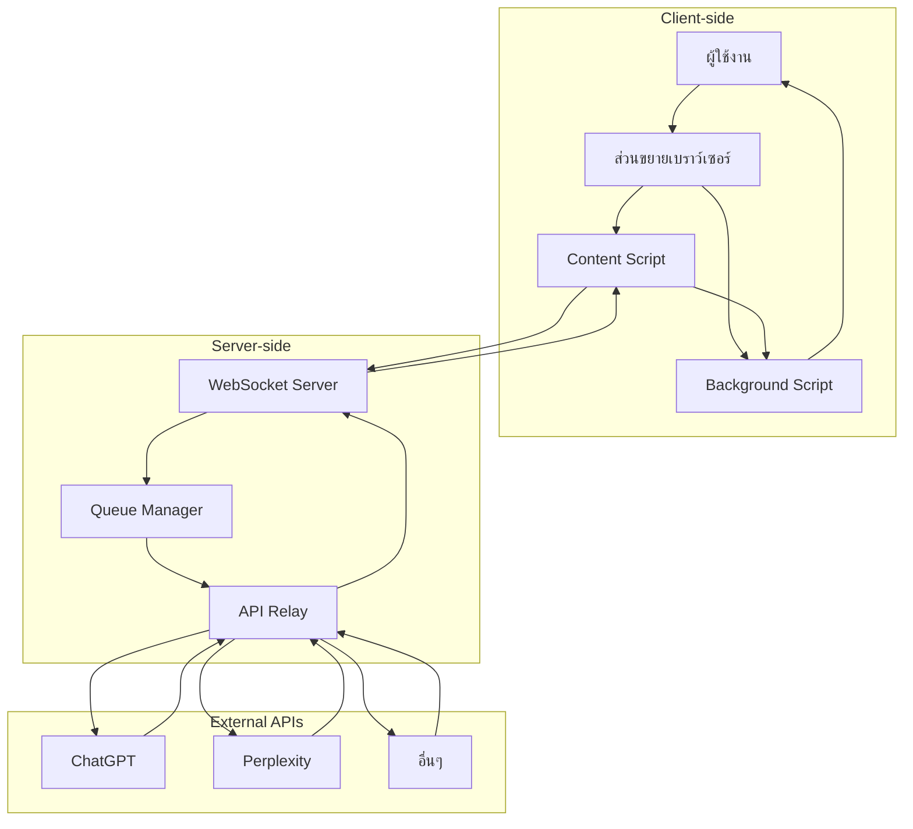
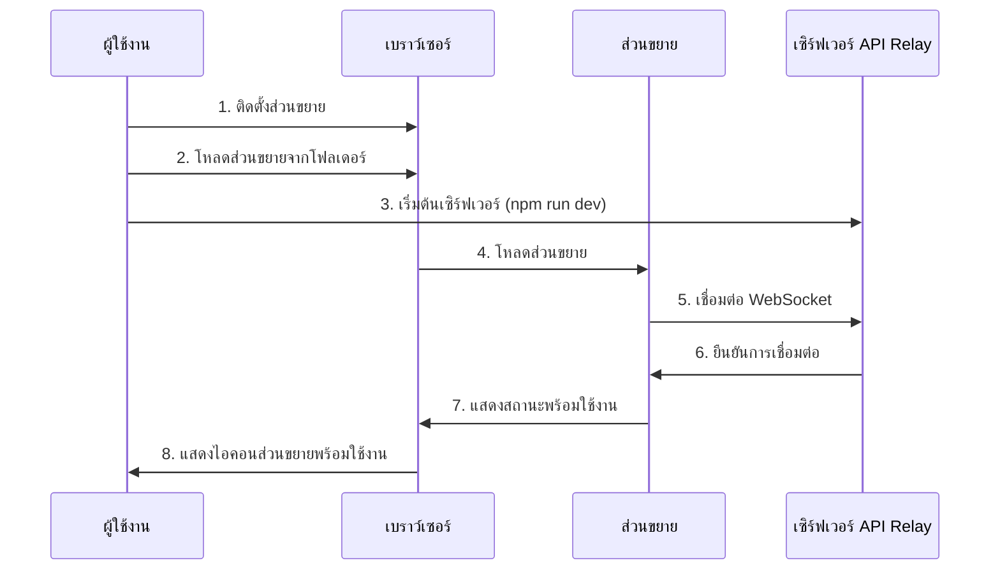
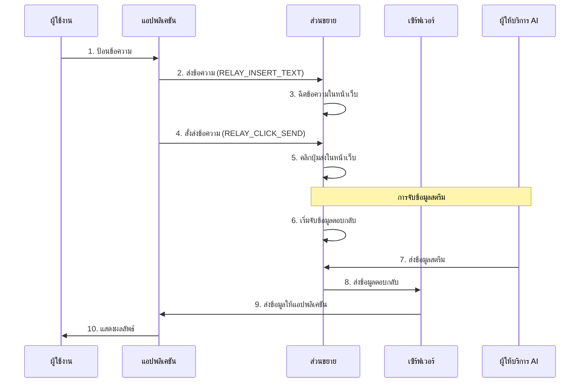
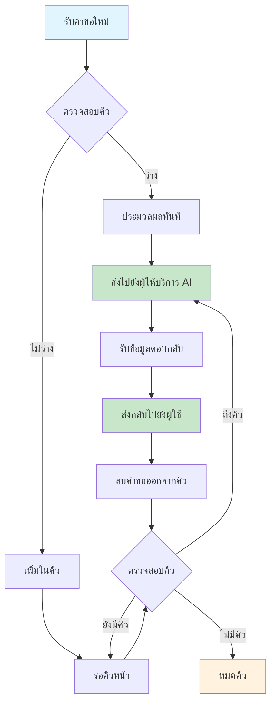
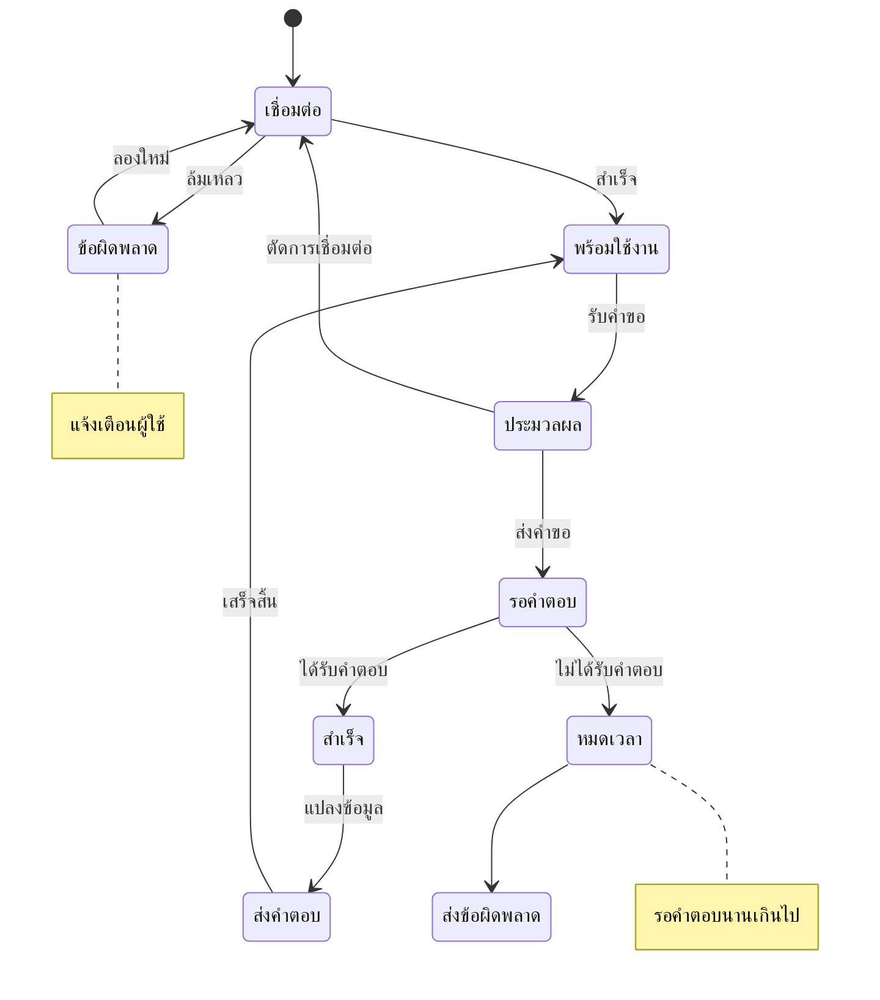
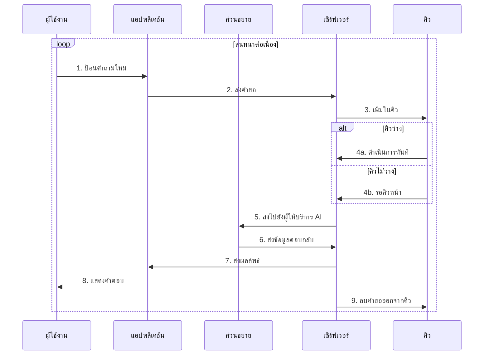
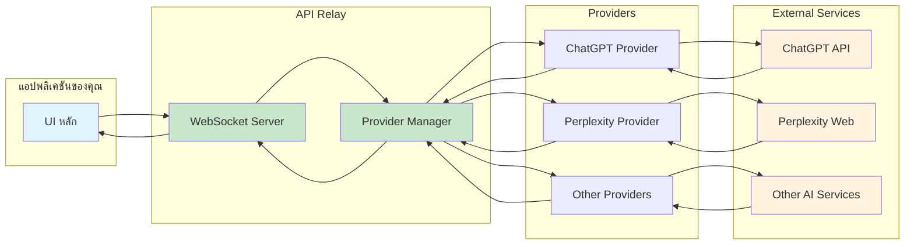
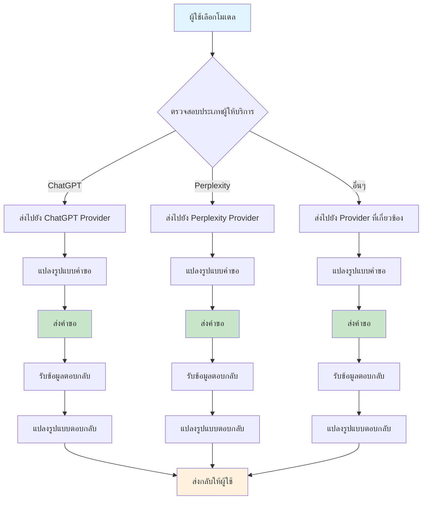

# ผังการทำงานของ API Relay

## ภาพรวมการทำงานของระบบ

## 1. การติดตั้งและเริ่มต้นระบบ

## 2. การส่งข้อความและรับคำตอบจาก AI

## 3. การจัดการคิวของคำขอ

## 4. การจัดการข้อผิดพลาด

## 5. การสนทนาหลายคำถาม

## 6. การสนับสนุนผู้ให้บริการหลายราย

## 7. การจัดการโมเดล AI ต่างๆ

## อธิบายภาพรวมการทำงาน

API Relay ทำงานในลักษณะของสะพานเชื่อม (bridge) ที่ช่วยให้คุณสามารถใช้งาน AI หลายๆ ตัวผ่านอินเทอร์เฟซเดียวกัน:

1. **การเริ่มต้น**: เมื่อเปิดใช้งาน ส่วนขยายจะเชื่อมต่อกับเซิร์ฟเวอร์ผ่าน WebSocket เพื่อสร้างช่องทางการสื่อสารแบบเรียลไทม์

2. **การส่งคำขอ**: เมื่อผู้ใช้ส่งข้อความ ส่วนขยายจะฉีดข้อความนั้นในหน้าเว็บของผู้ให้บริการ AI แล้วจำลองการคลิกปุ่มส่ง

3. **การจับข้อมูล**: ส่วนขยายจะจับการตอบสนองจากผู้ให้บริการ AI ทั้งแบบสตรีมและแบบข้อมูลเต็ม

4. **การส่งกลับ**: ข้อมูลจะถูกแปลงรูปแบบให้เข้ากันได้กับ API มาตรฐาน เช่น OpenAI หรือ Anthropic ก่อนส่งกลับให้แอปพลิเคชันของผู้ใช้

5. **การจัดการคิว**: คำขอจะถูกจัดเก็บในคิวเพื่อประมวลผลตามลำดับ ทำให้สามารถจัดการคำขอหลายรายการได้อย่างเป็นระบบ